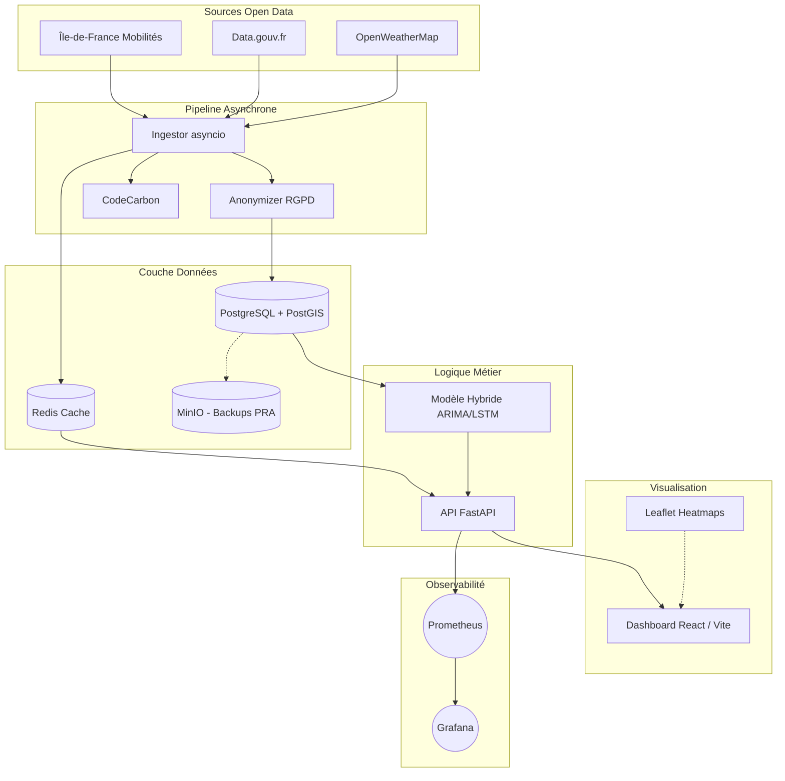

# 🏙️ UrbanFlow — Optimisation de la Mobilité Urbaine (M2 Big Data & IA)

[](https://www.python.org/downloads/)
[](https://fastapi.tiangolo.com)
[](https://vitejs.dev/)
[](https://www.docker.com/)
[](https://codecarbon.io/)

**UrbanFlow** est une plateforme industrielle complète conçue pour l'optimisation et la prédiction de la mobilité urbaine en Île-de-France. Ce projet a été réalisé dans le cadre du projet de fin d'études du Master 2 Big Data & Intelligence Artificielle.

Il collecte, traite et prédit le trafic en temps réel en s'appuyant sur un modèle de Machine Learning hybride (ARIMA + LSTM) et une architecture microservices robuste (Docker).

---

## 🌟 Fonctionnalités Clés & Réponse aux Exigences du Jury

1. **Pipeline ETL Asynchrone & Multi-sources** 🔄
   - Ingestion en temps réel des flux Open Data : Île-de-France Mobilités, Data.gouv.fr, OpenWeatherMap.
   - Utilisation de `asyncio` et `httpx` pour des performances non-bloquantes optimales.

2. **IA Hybride Spatio-Temporelle (ARIMA + LSTM)** 🧠
   - Modélisation baseline statistique (ARIMA) pour capturer les tendances cycliques du trafic.
   - Réseau de Neurones Profond (LSTM) pour détecter les patterns non-linéaires et les interdépendances temporelles.
   - Simulation en direct "Gestionnaire Urbain" (impact accident, météo, etc.).

3. **Dashboard React Intéractif & Accessible (RGAA / WCAG)** 🗺️
   - Interface "Dark Mode" moderne avec KPIs en temps réel.
   - Cartes thermiques dynamiques via Leaflet et OpenStreetMap (sans tracking commercial).
   - Accessibilité validée : contrastes daltonisme-safe, navigation clavier, attributs ARIA (10 pts de la grille).

4. **Conformité RGPD stricte (Privacy by Design)** 🔐
   - Module de crowdsourcing citoyen avec anonymisation immédiate à la source.
   - Hachage cryptographique des IPs (SHA-256 + sel), floutage des coordonnées GPS (±150m).
   - Identifiants éphémères jetables pour respecter le droit à l'oubli.

5. **Éco-conception & Green IT** 🌱
   - Intégration de la librairie `CodeCarbon` mesurant l'impact CO₂ des entraînements de modèles et des pipelines ETL.
   - Planification des entraînements de modèles durant les heures creuses (mix énergétique bas-carbone).
   - Stratégie de cache Redis agressive pour économiser les requêtes réseau et les calculs CPU.

6. **Architecture Résiliente (PRA/PCA)** 🛡️
   - Stockage spatio-temporel performant sur **PostgreSQL + PostGIS**.
   - Backups automatisés et simulés vers le Cloud (via container MinIO S3).

---

## 🏗️ Architecture Globale (Microservices)



---

## 🚀 Lancement Rapide (Environnement de Production Simulé)

Le projet est entièrement conteneurisé. Assurez-vous d'avoir **Docker** et **Docker Compose** installés et actifs sur votre machine.

### 1. Variables d'environnement
Copiez le fichier d'exemple pour créer votre `.env` local :
```bash
cp .env.example .env
```
*(Le fichier `.env` est déjà ignoré par Git pour des raisons de sécurité).*

### 2. Démarrer l'infrastructure
À la racine du projet, exécutez :
```bash
docker-compose up -d --build
```

### 3. Accès aux Services
Une fois l'orchestration lancée, les services sont accessibles sur :
- **Dashboard React** : [http://localhost:3000](http://localhost:3000) (ou 5173 en dev)
- **API FastAPI (Swagger)** : [http://localhost:8000/docs](http://localhost:8000/docs)
- **Monitoring Grafana** : [http://localhost:3001](http://localhost:3001) (identifiants par défaut: `admin` / `urbanflow_grafana_dev`)

---

## 📂 Structure du Répertoire

```text
urbanflow/
├── backend/            # API FastAPI et routes REST
│   ├── app/
│   │   ├── routers/    # Endpoints (traffic, crowdsourcing, environnement)
│   │   └── main.py     # Point d'entrée de l'API
│   └── requirements.txt
├── etl/                # Pipeline d'ingestion des données
│   ├── pipeline/
│   │   ├── ingestor.py # Orchestrateur asynchrone
│   │   └── transformers/gdpr_anonymizer.py
│   └── requirements.txt
├── frontend/           # Application React / Vite
│   ├── src/
│   │   ├── components/ # Composants UI (Cartes, KPIs, Accessibilité)
│   │   └── pages/      # Vues (Dashboard, Crowdsourcing)
│   └── package.json
├── infra/              # Configuration Docker et DevOps
│   ├── docker/         # Dockerfiles (Backend, ETL, Frontend)
│   └── monitoring/     # Prometheus et Grafana
├── ml/                 # Intelligence Artificielle
│   ├── models/         # Architecture LSTM/ARIMA
│   └── training/       # Scripts d'entraînement avec CodeCarbon
├── tests/              # Tests automatisés (Unitaires et Intégration)
├── docker-compose.yml  # Orchestration des microservices
└── architecture.md     # Documentation détaillée des choix techniques
```

---

## 🧪 Tests & Qualité de Code

Le projet intègre une suite de tests rigoureuse (Couverture unitaire, intégration API, et tests de charge).

Pour exécuter les tests localement :
```bash
# Tests unitaires et d'intégration
pytest tests/ -v

# Tests de charge (Locust)
locust -f tests/load/locustfile.py --host=http://localhost:8000
```

---
*Projet réalisé dans le cadre du M2 Big Data & Intelligence Artificielle.*
