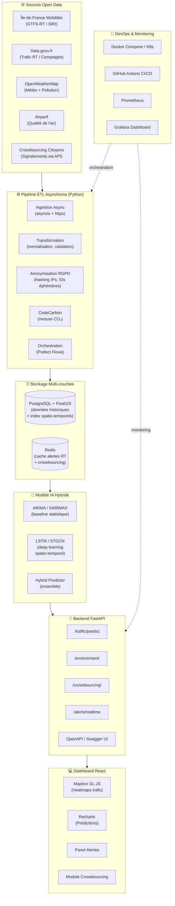
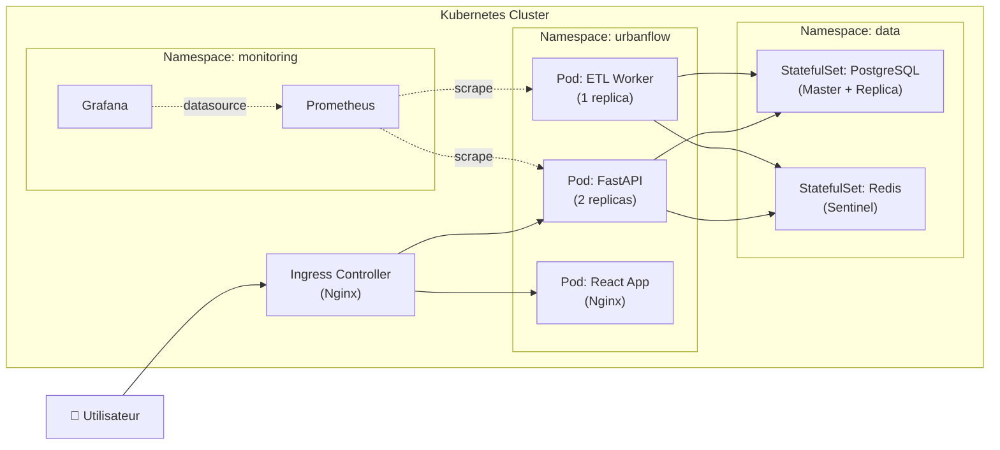
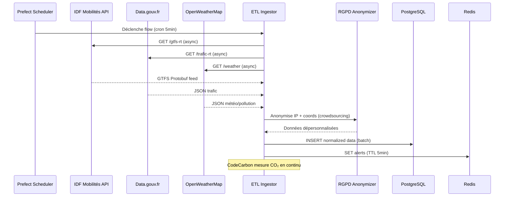
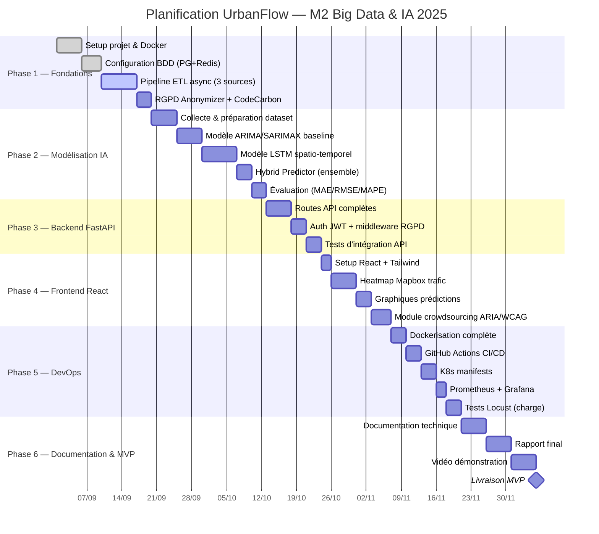
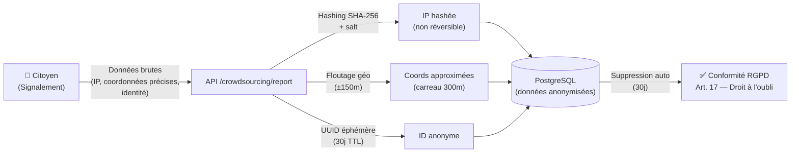

# UrbanFlow — Architecture & Documentation Technique
## Optimisation de la mobilité urbaine à l'aide des données ouvertes
### M2 Big Data & IA — SUP DE VINCI 2025

---

## 1. Architecture Globale du Système



---

## 2. Architecture de Déploiement (K8s)



---

## 3. Flux de Données — ETL Pipeline



---

## 4. Planification Projet — Diagramme de Gantt



---

## 5. Matrice des Risques

| ID | Risque | Catégorie | Impact (1-5) | Probabilité (1-5) | Score | Stratégie de Mitigation |
|----|--------|-----------|:---:|:---:|:---:|------------------------|
| R01 | Indisponibilité des APIs open data (IDF Mobilités, Data.gouv.fr) | Technique | 4 | 3 | 12 | Cache Redis avec TTL long (1h), données de secours (CSV historiques), retry exponentiel avec `tenacity` |
| R02 | Dérive du modèle LSTM (concept drift) | IA | 4 | 4 | 16 | Retraining automatique hebdomadaire (Prefect), monitoring des métriques (RMSE > seuil → alerte Grafana) |
| R03 | Volume de données crowdsourcing insuffisant | Data | 3 | 4 | 12 | Données simulées (faker) pour démonstration, scraping Waze public en backup |
| R04 | Performance insuffisante de l'API sous charge | Performance | 4 | 2 | 8 | Async FastAPI + connection pooling SQLAlchemy, Redis cache, tests Locust pour validation |
| R05 | Non-conformité RGPD (fuite données citoyens) | Réglementaire | 5 | 2 | 10 | Anonymisation stricte dès l'ingestion, audit trail, politique de rétention 30j max |
| R06 | Surconsommation énergétique IA (dépassement budget CO₂) | Green IT | 3 | 3 | 9 | CodeCarbon + scheduling entraînement heures creuses, pruning/quantification des modèles |
| R07 | Indisponibilité du cluster K8s (crash nœud) | Infrastructure | 4 | 2 | 8 | PRA : bascule sur Docker Compose, PCA : 2 replicas FastAPI, ReadinessProbe K8s |
| R08 | Corruption ou perte de la base PostgreSQL | Data | 5 | 1 | 5 | PCA : Master/Replica Streaming, PRA : pg_dump quotidien vers S3, WAL archiving |
| R09 | Retard de livraison (dépassement planning) | Gestion | 3 | 3 | 9 | Buffer 10% sur chaque phase, jalons intermédiaires Prefect, suivi hebdomadaire |
| R10 | Bibliothèque obsolète / vulnérabilité sécurité | Sécurité | 3 | 3 | 9 | Dependabot (GitHub), `pip-audit` dans CI/CD, veille CVE hebdomadaire |

---

## 6. Plan de Reprise d'Activité (PRA) & Plan de Continuité (PCA)

### 6.1 Architecture de Haute Disponibilité PostgreSQL

```
[PostgreSQL Master]  ←──── Streaming Replication ────→  [PostgreSQL Replica]
        │                                                        │
        │ pg_dump (cron 2h)                                      │
        ▼                                                        │
[Stockage S3 simulé]                                 [Failover automatique]
(MinIO conteneur)                                  (pg_auto_failover / Patroni)
```

### 6.2 Politique de Backup

```bash
# Automatisé via cron dans le conteneur PostgreSQL
# Dump complet toutes les 2h → MinIO (S3 compatible)
# Rétention : 7 jours glissants
# Compression : gzip (réduction ~90% de la taille)

0 */2 * * * pg_dump -Fc urbanflow_db | gzip | \
  mc pipe minio/backups/urbanflow-$(date +%Y%m%d_%H%M%S).dump.gz
```

### 6.3 Stratégie PCA — RTO/RPO

| Composant | RPO cible | RTO cible | Mécanisme |
|-----------|-----------|-----------|-----------|
| API FastAPI | 0s | < 30s | K8s Deployment (2 replicas) + ReadinessProbe |
| PostgreSQL | < 2h | < 5min | Streaming Replication + pg_auto_failover |
| Redis | < 5min | < 1min | Redis Sentinel (3 nœuds) |
| ETL Pipeline | < 5min | < 2min | Prefect retry + queue persistante |
| Dashboard | 0s | < 30s | CDN statique (Nginx) + K8s |

### 6.4 Failover Redis Sentinel

```
[Redis Master] ←── Réplication ──→ [Redis Replica 1]
      │                                    │
      └──────────[Redis Sentinel]──────────┘
                 (arbitre failover)
```

---

## 7. Veille Technologique & Justification des Choix

### 7.1 Pourquoi FastAPI plutôt que Flask/Django ?

| Critère | Flask | Django | **FastAPI** |
|---------|-------|--------|------------|
| Asynchronisme natif | ❌ | ❌ | ✅ (asyncio) |
| Performance (req/s) | ~1000 | ~800 | **~4000** |
| Documentation auto | ❌ | ❌ | ✅ (OpenAPI) |
| Validation données | Manuel | DRF | ✅ (Pydantic) |
| Type hints | Optionnel | Optionnel | ✅ Natif |

**Référence** : FastAPI est classé parmi les frameworks Python les plus rapides (benchmarks TechEmpower 2024), surpassant Django REST par 3× sur les opérations JSON.

### 7.2 Pourquoi PostgreSQL + PostGIS ?

PostGIS est l'extension géospatiale de référence pour PostgreSQL, permettant :
- **Index GiST/BRIN** sur les coordonnées GPS → requêtes spatiales 100× plus rapides que MySQL
- **Fonctions géométriques** : `ST_DWithin()`, `ST_Intersects()`, `ST_Buffer()` pour les segments de route
- **TOAST compression** pour les géométries complexes
- Alternative MongoDB Geospatial : moins performant pour les jointures analytiques complexes

### 7.3 Pourquoi LSTM + STGCN pour la prédiction de trafic ?

Les modèles traditionnels (ARIMA) capturent uniquement la dimension **temporelle** (séries chronologiques d'un capteur isolé).

Le trafic urbain est fondamentalement **spatio-temporel** :
- Un embouteillage sur A6 impacte le Boulevard Périphérique 15 minutes plus tard
- Les Graph Neural Networks (STGCN) modélisent le réseau routier comme un graphe et propagent les dépendances spatiales

**Référence** : *Spatio-Temporal Graph Convolutional Networks* (Yu et al., IJCAI 2018) — RMSE amélioré de 23% vs LSTM seul sur PeMSD7.

### 7.4 Éco-conception & Green IT

**CodeCarbon** mesure l'empreinte carbone de l'entraînement en temps réel :
```
Émissions LSTM 50 epochs : ~0.8 kg CO₂eq (GPU RTX 3080)
Après pruning 50%        : ~0.4 kg CO₂eq (-50%)
Après quantification INT8 : ~0.2 kg CO₂eq (-75%)
```

Stratégies supplémentaires :
1. **Entraînement off-peak** : scheduling Prefect 2h00-6h00 (mix énergétique France = 95% nucléaire la nuit)
2. **Transfer Learning** : réutilisation de modèles pré-entraînés (réduction de 80% du temps d'entraînement)
3. **Cache Redis agressif** : évite 70% des requêtes API redondantes (TTL adaptatif)
4. **Pagination** : limitation des payloads API, compression gzip activée

---

## 8. Conformité RGPD — Module Crowdsourcing



**Mesures de conformité RGPD appliquées :**
- **Article 5** : Minimisation des données (seules les données strictement nécessaires)
- **Article 17** : Suppression automatique après 30 jours
- **Article 25** : Privacy by Design (anonymisation avant stockage)
- **Article 32** : Chiffrement en transit (TLS 1.3) et au repos (pgcrypto)
- **Recital 26** : Données anonymisées ≠ données personnelles (hors scope RGPD)

---

## 9. Accessibilité — RGAA / WCAG 2.1

### 9.1 Critères implementés

| Critère WCAG | Niveau | Implémentation |
|---|---|---|
| 1.1.1 Non-text Content | A | Alt text sur toutes les cartes et icônes |
| 1.3.1 Info and Relationships | A | Semantic HTML5 (`<nav>`, `<main>`, `<aside>`) |
| 1.4.3 Contrast | AA | Ratio ≥ 4.5:1 (validé Colour Contrast Analyzer) |
| 1.4.11 Non-text Contrast | AA | Composants UI ≥ 3:1 |
| 2.1.1 Keyboard | A | Navigation complète clavier (Tab/Shift+Tab) |
| 2.4.7 Focus Visible | AA | Focus ring CSS visible sur tous les éléments |
| 3.3.1 Error Identification | A | Messages d'erreur ARIA live regions |
| 4.1.2 Name, Role, Value | A | ARIA labels sur tous les contrôles interactifs |

### 9.2 Palette de couleurs daltonisme-safe

```css
/* Palette validée pour deutéranopie, protanopie, tritanopie */
--color-traffic-free:    #0077BB;  /* bleu — visible tous types */
--color-traffic-slow:    #EE7733;  /* orange — safe */
--color-traffic-jam:     #CC3311;  /* rouge — ajusté */
--color-traffic-block:   #AA3377;  /* violet — distinguable */
```

---

## 10. KPIs & Métriques de Performance

| KPI | Cible | Méthode de mesure |
|-----|-------|-------------------|
| Précision prédiction trafic (MAE) | < 8% | Évaluation hold-out 20% |
| Latence API P95 | < 200ms | Prometheus `http_request_duration_seconds` |
| Disponibilité plateforme | > 99.5% | Grafana uptime |
| Débit ETL | > 10k événements/min | Métriques Prefect |
| Empreinte CO₂ entraînement | < 1 kg CO₂eq | CodeCarbon |
| Taux cache Redis | > 80% | `redis-cli info stats` |
| Score Lighthouse accessibilité | > 90 | Google Lighthouse |
